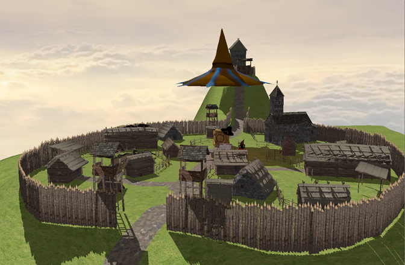

# Magic Wizard World in OpenGL 🧙‍♂️✨

## Overview
This project is an interactive graphical application developed using OpenGL, where users can explore a dynamic 3D scene. The scene features various objects like a "witch's broom," a "flying hat," a "cat with a pumpkin," and a "magical world" with complex landscapes, dynamic lighting, shadows, and camera controls. The goal is to create a visually rich and immersive environment where users can interact with magical elements and explore the world from multiple perspectives.

## 1. Theme presentation
The theme of this project is to develop an interactive graphical application using OpenGL, which is a standardized API for creating 2D and 3D graphics. The main goal of the application is to create a dynamic 3D scene where users can interact with various objects and visual effects. The application will include several 3D objects, such as a "witch's broom," a "flying hat," a "cat with a pumpkin," and a "virtual world" with a complex landscape, dynamic lighting, shadows, and camera control.

Key objectives:
- **Create an interactive 3D scene**: Users can interact with objects loaded from external files and place them in a 3D space with precise coordinates.
- **Lighting and Shadows**: Dynamic lighting will be implemented, including directional and point light sources. Shadow Mapping will be used to create realistic shadows.
- **Camera Movement**: Users will be able to control the camera using the keyboard and mouse, offering a free-angle view to explore the scene.
- **Control Objects**: Some objects, like the flying hat, will have dynamic behaviors, such as moving up and down.
- **Depth Map Visualization**: A feature to observe depth maps for understanding how shadows are generated.

## 2. Scene

### 2.1. Scene Description
The 3D scene is made up of a virtual island, with a medieval village, including houses, a church, and a hill. To make the story more magical, we've added objects from the world of magic like a magic box, a flying hat, dragons, and a magical pumpkin.

### 2.2. Functionalities
The application will include various features to enhance interactivity and realism:
- **Camera Movement**: The user can move through the scene using the keyboard and mouse.
- **Dynamic Lighting and Shadows**: A directional light source that can be adjusted to modify shadows and lighting effects.
- **Depth Map View**: Users can visualize the depth map generated during shadow mapping to understand how shadows are projected onto objects.
- **Different View Modes**: Switch between wireframe, solid, and smooth visualization modes.

## 3. Implementation

### 3.1. Graphic Model
The graphical model includes several 3D objects, each described by a mathematical representation in 3D model files (usually `.obj` format). The placement and "harmony" of these objects in the scene were created using Blender, a popular open-source 3D modeling software.

### 3.2. Data Structures
- **Transformation Matrices**: Each object in the scene is associated with a transformation matrix (`glm::mat4`), updated at each frame for position and rotation.
- **Camera and Light Coordinates**: The positions of the light source and camera are managed using `glm::vec3` variables.
- **Textures and Shaders**: Textures and shaders are loaded and applied to objects in an optimized way.
- **Framebuffers**: For shadow mapping, framebuffers store depth maps to calculate shadows efficiently.

## 4. GUI Interface
The graphical interface is designed to be minimalist, without visible controls on the screen, allowing the user to focus on the scene. The user interacts with the scene by controlling the camera and objects.

### User Manual
- **Camera Movement**:
  - `W`: Move forward
  - `S`: Move backward
  - `A`: Move left
  - `D`: Move right
- **Camera Rotation**: Rotate using the mouse to change the viewing angle.
- **Visualization Modes**:
  - `F`: Wireframe mode
  - `U`: Solid mode
  - `N`: Smooth mode
- **Presentation Animation**: Press `B` for a special animation showcasing the magical elements.
- **Fog Effect**: Press `C` to activate fog on the island, with adjustable density via code.

---

